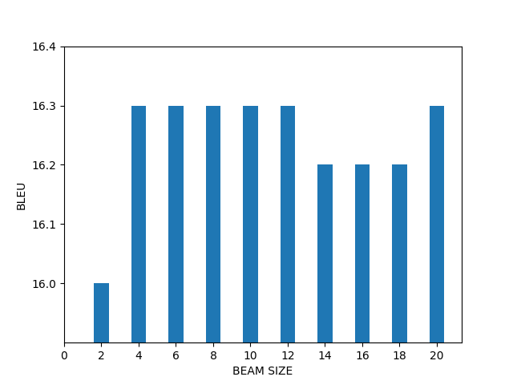

# Steps
(adapted from the repo of bricksdont)

Clone this repository in the desired place and check out the correct branch:

```sh
git clone https://github.com/h-schaller/joeynmt-toy-models.git
cd joeynmt-toy-models
checkout ex5
```

Create a new virtualenv that uses Python 3. Please make sure to run this command outside of any virtual Python environment:

```sh
./scripts/make_virtualenv.sh
```

Activate the env by executing the `source` command that is output by the shell script above:

```sh
source venvs/torch3/bin/activate
```

Download and install required software:

```sh
./scripts/download_install_packages.sh
```

Download data:
```sh
./scripts/download_data.sh
```

Preprocess data:

```sh
./scripts/preprocess_data.sh
```

Train and apply a BPE model and create vocabulary file for training. Do this for vocabulary size of 2000 and 3000:

```sh
./scripts/train_and_apply_bpe.sh
```

Then train and evaluate the three models:

```sh
./scripts/train_model.sh
```

# Changes
The following scripts were added and/or changed to build three translation systems with the translation direction of German to English:
- download_install_packages.sh: This also installs a specific version of `sacremoses` that is needed for tokenisation.
- preprocess_data.sh: This calls the Python file `subsample.py` with which it is possible to subsample a certain number of lines from the training data files. It also tokenises all texts needed for training.
- train_and_apply_bpe.sh: This learns and applies two different BPE models with `subword-nmt` (with vocabulary size 2'000 and 3'000) and creates joint vocabulary files needed for training with JoeyNMT.
- train_model.sh: This script trains all three models and evaluates them successively.
- evaluate_bpe-level.sh and evaluate_word-level.sh: These are called in train_model.sh to compute the BLEU score of the trained models. evaluate_word-level.sh removes tokenisation for the translated text while evaluate_bpe-level.sh also removes byte pair encoding.
- files in `configs` to train the word-level and the two subword-level translation models

# Findings
The following BLEU scores were calculated for the three trained models:

|  | use BPE | vocabulary size | BLEU
--- | --- | --- | ---
(a) | no | 2000 | 10.7
(b) | yes | 2000 | 12.2
(c) | yes | 3000 | 16.2

As can be seen, there is an improvement of 1.5 BLEU when using a subword vocabulary when compared to using a whole-word vocabulary.
When a larger subword vocabulary is used to train a translation model, the improvement of the BLEU score becomes even clearer with an improvement of 4 BLEU compared to the model trained with a smaller subword vocabulary.

Eying the translations, I assume that the worse BLEU score of the model trained with the whole-word vocabulary correlates with the numerous '<unk>' symbols in the translations (which of course do nothing to improve the BLEU score, they just make the text disfluent). Also, many words which transport the main message of a sentence are missing because they don't appear in the vocabulary, and only frequently occurring phrases which aren't highly relevant content-wise, for example XY, are translated.
Regarding the two models trained with subword vocabularies, it makes sense that the one trained with a larger vocabulary is better since it can translate even more words that were unseen during training as long as they contain the subword units that were used for training the translation model.

# Part II: Impact of beam size on translation quality
To test translating with beam sizes from 2 to 20, run the following script. This will translate the test set 10 times with the best model from above, the model using a subword vocabulary of size 3'000:

```sh
./scripts/analyse_beam_sizes.sh
```

**This is the resulting graph:**




As can be seen on the graph, the beam size doesn't influence the BLEU score greatly. Since a beam size of 4 showed the best result with only being 4 times slower than using a beam size of 1, I would go for this beam size.
